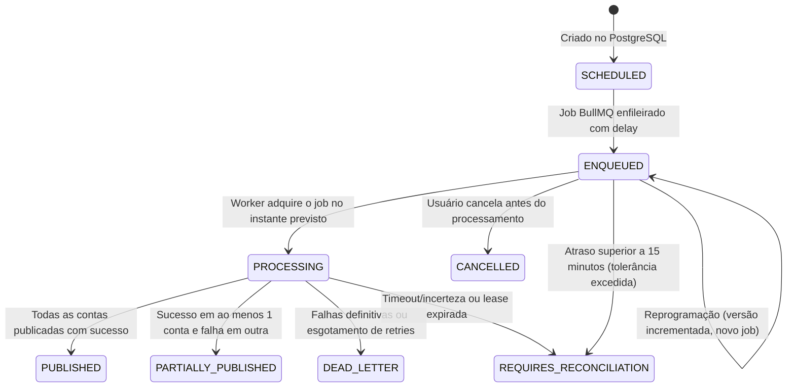

# Arquitetura e Operação do Agendador (Scheduler - Fase 4)

## 1. Visão Geral e Princípios Arquiteturais

O subsistema de agendamento do SocialFlow permite programar publicações de posts previamente aprovados (`APPROVED`) para uma ou mais contas sociais ativas (`FACEBOOK_PAGE`, `INSTAGRAM_BUSINESS`) em data, hora e fuso horário especificados.

### Princípios Fundamentais

1. **PostgreSQL como Fonte Única da Verdade**: O estado da publicação, as tentativas e os agendamentos são persistidos no PostgreSQL antes de qualquer interação com filas assíncronas. O Redis/BullMQ atua como mecanismo de temporização e distribuição de jobs, nunca como repositório primário.
2. **Idempotência e Prevenção de Duplicidades**: Garantida por restrições de unicidade no banco (`PublicationAttempt`), mecanismo de _lease_ com expiração atômica (`leaseExpiresAt`) e jobs BullMQ com IDs determinísticos.
3. **Desacoplamento de Transações**: A reserva de publicação (fase 1) ocorre em transação curta de banco de dados (`preparePublication`). As chamadas à Meta Graph API (fase 2 - `executePublication`) ocorrem estritamente fora de transações de banco de dados, evitando segurar locks e exaurir conexões.
4. **Resiliência a Falhas e Reconciliação**: Recuperação automática de jobs ausentes, cancelamento seguro, detecção de versões obsoletas e quarentena para reconciliação manual (`REQUIRES_RECONCILIATION`) quando o atraso ultrapassar a janela de segurança operacional (15 minutos).

---

## 2. Máquina de Estados de Agendamento

O ciclo de vida do agendamento é representado pelo enum `PublicationScheduleStatus`:



### Descrição dos Estados

- **`SCHEDULED`**: Agendamento persistido no PostgreSQL; transição intermediária antes do enfileiramento no Redis.
- **`ENQUEUED`**: Job registrado no BullMQ com atraso (`delay`) correspondente ao intervalo até o instante UTC.
- **`PROCESSING`**: Worker assumiu a execução do agendamento e iniciou a reserva de tentativas no PostgreSQL.
- **`PUBLISHED`**: Todas as contas selecionadas foram publicadas com confirmação e IDs remotos na Meta.
- **`PARTIALLY_PUBLISHED`**: Ao menos uma conta foi publicada e outra(s) sofreram falha definitiva. Sucessos são preservados e nunca republicados.
- **`FAILED`**: Falha na fase de validação ou preparação do agendamento.
- **`CANCELLED`**: Cancelado explicitamente por usuário autorizado antes do início do processamento.
- **`DEAD_LETTER`**: Esgotamento das tentativas com falha definitiva (ex: credencial revogada, erro de permissão, erro irrecuperável).
- **`REQUIRES_RECONCILIATION`**: Situações com incerteza sobre o status da publicação (ex.: timeout na Meta, lease expirada ou job atrasado mais de 15 minutos). Requer inspeção operacional e resolução manual.

---

## 3. Gestão de Timezones

### Decisão Técnica

O sistema utiliza a API nativa ECMAScript `Intl.DateTimeFormat` com o banco IANA (`Intl.supportedValuesOf("timeZone")`), garantindo zero dependências externas pesadas e total compatibilidade com o runtime Node.js.

### Regras de Conversão

1. **Validação**: Somente identificadores IANA válidos são aceitos (ex: `America/Cuiaba`, `America/Sao_Paulo`, `UTC`).
2. **Armazenamento**:
   - `scheduledTimezone`: Fuso horário original informado pelo usuário (padrão: fuso da organização ou `America/Cuiaba`).
   - `scheduledLocalTime`: String ISO do horário local sem fuso (ex: `2026-09-25T14:30:00`).
   - `scheduledForUtc`: `DateTime` (timestamp com fuso) convertido no servidor para o instante exato em UTC.
3. **Horário de Verão e Transições**:
   - Gaps (horários inexistentes devido ao adiantamento do relógio): mapeados para o primeiro instante válido após a transição.
   - Folds (horários ambíguos devido ao atraso do relógio): interpretados de forma estável respeitando a ordem cronológica da transição.
   - Independência de ambiente: O timezone do container Docker ou sistema operacional do host não afeta o cálculo.

---

## 4. BullMQ e Configuração de Filas

### Identificador Determinístico de Job

Para evitar duplicidades em reinicializações e permitir remoção rápida em cancelamentos/reprogramações, o ID do job BullMQ segue o formato:

```text
sched:{scheduleId}:v{version}
```

- Exemplo: `sched:3c23d537-8898-4c12-ba2e-fc5aaec02ad5:v1`
- Ao reprogramar, a versão é incrementada para `v2`, o job antigo `v1` é removido e um novo job `v2` é enfileirado.
- Caso um worker receba tardiamente um job com versão defasada (`job.data.version !== schedule.version`), o job é descartado silenciosamente sem qualquer publicação.

### Política de Retries e Backoff

- **Concorrência**: 5 workers concorrentes por processo (configurável).
- **Tentativas máximas**: 4 tentativas para erros transitórios.
- **Backoff**: Exponencial com jitter (`delay: 10000 * 2^(attempt-1)`).
- **Erros Transitórios (elegíveis a retry)**:
  - Códigos HTTP 500, 502, 503, 504.
  - Códigos de erro Meta: 1, 2, 4, 17, 341.
  - Subcódigos de rate limit temporário e network drops (ECONNRESET, ETIMEDOUT).
- **Erros Definitivos (sem repetição automática)**:
  - Falhas de autenticação (`OAuthException`, token expirado/revogado, códigos 102, 190).
  - Permissões ausentes (código 10, 200-299).
  - Mídia inválida, dimensões incompatíveis ou parâmetros inválidos (código 100).
  - Estados remotos incertos (`UNCERTAIN`).

---

## 5. Idempotência e Execução Concorrente

1. **Proteção em Duas Fases**:
   - **Fase 1 (`preparePublication`)**: Executada em transação PostgreSQL isolada com locks nos registros de post e tentativas. Marca cada `PublicationAttempt` como `PROCESSING` com `leaseExpiresAt = now + 10 minutos`. Se outra transação já tiver reservado a conta, aborta imediatamente.
   - **Fase 2 (`executePublication`)**: Executada fora de transação. Realiza chamadas à Meta Graph API com o token decriptografado em memória.
2. **Sucesso Parcial e Reentrância**:
   - O worker processa cada conta individualmente. Se uma conta já se encontra com status `PUBLISHED`, ela é ignorada sem duplicação.
   - Contas que falharem definitivamente são gravadas com status `FAILED`.
3. **Resolução de Incerteza**:
   - Se ocorrer timeout ou falha de rede durante o upload ou publicação do contêiner, a tentativa é marcada como `UNCERTAIN` e o agendamento como `REQUIRES_RECONCILIATION`. O worker nunca tenta publicar novamente um contêiner ou post em estado incerto.

---

## 6. Cancelamento e Reprogramação

### Cancelamento (`POST .../schedules/:scheduleId/cancel`)

- Permitido para agendamentos nos status `SCHEDULED` ou `ENQUEUED`.
- Atualiza atomicamente o agendamento para `CANCELLED`, grava o motivo e emite `AuditLog` (`schedule.cancelled`).
- Remove o job correspondente do BullMQ.
- Se o agendamento já estiver em `PROCESSING`, a API recusa com código `409 Conflict`, informando que a publicação já está em andamento.

### Reprogramação (`POST .../schedules/:scheduleId/reschedule`)

- Permitido apenas antes do início do processamento.
- Valida que a nova data/hora informada é futura em relação ao momento atual.
- Incrementa `version` de 1 para 2.
- Remove o job antigo (`sched:{id}:v1`) do Redis e cria um novo job (`sched:{id}:v2`) com o novo delay em UTC.
- Registra evento de auditoria `schedule.rescheduled`.

---

## 7. Política de Jobs Atrasados e Reconciliação na Inicialização

### Janela de Tolerância a Atrasos

- **Atraso até 15 minutos**: O worker considera o atraso aceitável (ex: reinício breve de serviço) e procede com a execução normal.
- **Atraso superior a 15 minutos**: O worker **não publica automaticamente**. O agendamento é transicionado para `REQUIRES_RECONCILIATION`, a falha é descrita no registro e um log de auditoria `schedule.reconciliation_required` é gerado para revisão manual da equipe.

### Rotina de Inicialização (`runStartupReconciliation`)

Executada sempre que o processo do worker é inicializado (e disponível para disparo operacional manual):

1. **Agendamentos sem job BullMQ**: Localiza registros no PostgreSQL em status `SCHEDULED` ou `ENQUEUED` cujo job não exista no Redis (ex: queda do Redis antes da inserção) e reinjeta o job na fila.
2. **Execuções abandonadas**: Localiza agendamentos em `PROCESSING` cujas tentativas de publicação estejam com `leaseExpiresAt` expirada. Marca o agendamento como `REQUIRES_RECONCILIATION`.

---

## 8. Runbook Operacional

### Monitoramento e Métricas

- Monitorar a contagem de agendamentos em `REQUIRES_RECONCILIATION` e `DEAD_LETTER`.
- Verificar o número de jobs atrasados na fila `publication-schedule`.

### Tratamento de Agendamentos em `REQUIRES_RECONCILIATION`

1. Consultar o agendamento afetado:
   ```sql
   SELECT id, "postId", status, "failureReason", "scheduledForUtc", "updatedAt"
   FROM "PublicationSchedule"
   WHERE status = 'REQUIRES_RECONCILIATION';
   ```
2. Verificar as tentativas de publicação associadas:
   ```sql
   SELECT id, "socialAccountId", status, "remoteMediaId", "creationContainerId", "errorMessage"
   FROM "PublicationAttempt"
   WHERE "scheduleId" = '<ID_DO_AGENDAMENTO>';
   ```
3. Se a publicação não ocorreu na Meta (confirmado via painel da Meta ou Graph API Explorer) e o post ainda deve ser publicado:
   - Utilizar a interface para criar um novo agendamento ou publicar manualmente.
4. Se a publicação já ocorreu na Meta:
   - Atualizar a tentativa com o `remoteMediaId` e marcar status como `PUBLISHED`.

### Comandos de Teste e Validação Local

```bash
# Executar suíte de testes de timezone
pnpm test tests/unit/timezone.test.ts

# Executar suíte de testes de integração do scheduler (23 cenários com mocks)
node scripts/run-tests.mjs integration tests/integration/scheduler.test.ts

# Executar todos os testes de integração
node scripts/run-tests.mjs integration
```
