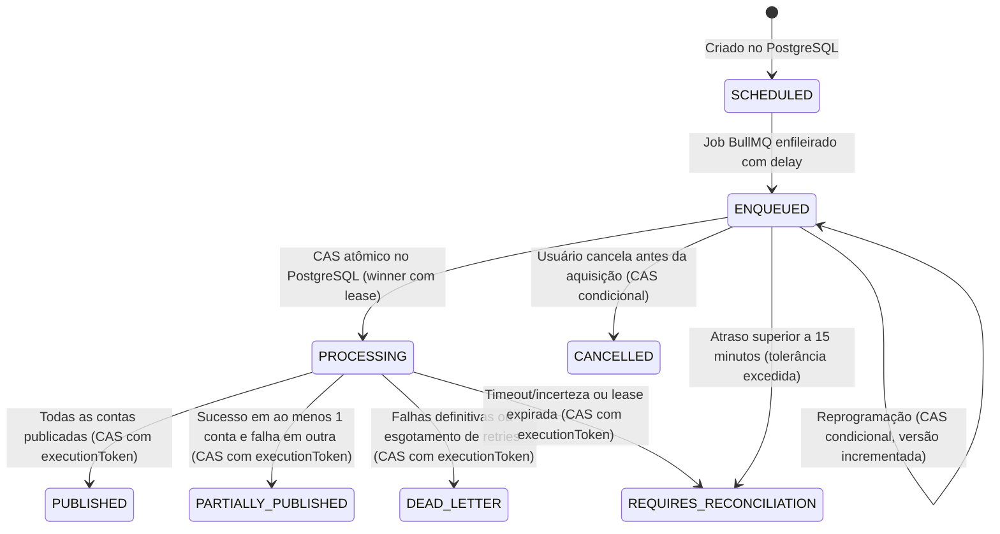

# Arquitetura e Operação do Agendador (Scheduler - Fase 4)

## 1. Visão Geral e Princípios Arquiteturais

O subsistema de agendamento do SocialFlow permite programar publicações de posts previamente aprovados (`APPROVED`) para uma ou mais contas sociais ativas (`FACEBOOK_PAGE`, `INSTAGRAM_BUSINESS`) em data, hora e fuso horário especificados.

### Princípios Fundamentais

1. **PostgreSQL como Fonte Única da Verdade**: O estado da publicação, as tentativas e os agendamentos são persistidos no PostgreSQL antes de qualquer interação com filas assíncronas. O Redis/BullMQ atua como mecanismo de temporização e distribuição de jobs, nunca como repositório primário.
2. **Aquisição Atômica por Compare-and-Set (CAS)**: A transição de `ENQUEUED`/`SCHEDULED` para `PROCESSING` ocorre via CAS no PostgreSQL exigindo simultaneamente `id`, `version` e `status` elegível. Apenas o worker que afetar exatamente 1 linha adquire o agendamento; competidores recebem `skipped_not_acquired`.
3. **Lease de Execução Própria**: O agendamento possui `executionToken` (UUID gerado para cada tentativa de execução) e `leaseExpiresAt` (10 minutos). Todas as transições de finalização exigem casamento exato de `executionToken`, `version` e `status: PROCESSING`.
4. **Ator Técnico do Sistema (`system:scheduler`)**: A execução do worker não depende da vigência da conta do usuário que criou o agendamento (`createdById` é preservado). O worker opera sob a identidade técnica limitada `system:scheduler` vinculada estritamente aos parâmetros de tenant `app.scheduler_org_id` e `app.scheduler_client_id`, respeitando RLS sem superusuário ou bypass irrestrito.
5. **Ciclo de Vida Explícito de Recursos**: A fila BullMQ não utiliza singletons globais sem vínculo de conexão. Instâncias são criadas por conexão (`createScheduleQueue`) e fechadas graciosamente (`closeScheduleQueue`) na ordem correta junto à API e worker.
6. **Desacoplamento de Transações**: A reserva de publicação ocorre em transação curta de banco de dados (`preparePublication`). As chamadas à Meta Graph API ocorrem estritamente fora de transações de banco de dados, evitando segurar locks e exaurir conexões.
7. **Resiliência a Falhas e Reconciliação**: Recuperação automática de jobs ausentes, cancelamento seguro, detecção de versões obsoletas e quarentena para reconciliação manual (`REQUIRES_RECONCILIATION`) quando o atraso ultrapassar a janela de segurança operacional (15 minutos).

---

## 2. Máquina de Estados de Agendamento

O ciclo de vida do agendamento é representado pelo enum `PublicationScheduleStatus`:



### Descrição dos Estados

- **`SCHEDULED`**: Agendamento persistido no PostgreSQL; transição intermediária antes do enfileiramento no Redis.
- **`ENQUEUED`**: Job registrado no BullMQ com atraso (`delay`) correspondente ao intervalo até o instante UTC.
- **`PROCESSING`**: Worker venceu o CAS atômico, adquiriu a lease de execução (`executionToken`) e iniciou o processamento.
- **`PUBLISHED`**: Todas as contas selecionadas foram publicadas com confirmação e IDs remotos na Meta.
- **`PARTIALLY_PUBLISHED`**: Ao menos uma conta foi publicada e outra(s) sofreram falha definitiva. Sucessos são preservados e nunca republicados.
- **`FAILED`**: Falha na fase de validação ou preparação do agendamento.
- **`CANCELLED`**: Cancelado explicitamente por usuário autorizado antes do início do processamento.
- **`DEAD_LETTER`**: Esgotamento das tentativas com falha definitiva (ex: credencial revogada, erro de permissão, erro irrecuperável).
- **`REQUIRES_RECONCILIATION`**: Situações com incerteza sobre o status da publicação (ex.: timeout na Meta, lease expirada ou job atrasado mais de 15 minutos). Requer inspeção operacional e resolução manual.

---

## 3. Aquisição Atômica e Proteção de Estados Finais

### Compare-And-Set (CAS) de Aquisição

Dois workers que tentarem processar o mesmo agendamento simultaneamente competem no PostgreSQL:

```typescript
const acquiredCount = await prisma.publicationSchedule.updateMany({
  where: {
    id: scheduleId,
    version: expectedVersion,
    status: { in: ["SCHEDULED", "ENQUEUED"] },
  },
  data: {
    status: "PROCESSING",
    executionToken,
    leaseExpiresAt: new Date(Date.now() + 10 * 60 * 1000),
  },
});

if (acquiredCount.count !== 1) {
  return { status: "skipped_not_acquired" };
}
```

- Apenas o worker que alterar exatamente 1 linha adquire o agendamento e registra o evento de auditoria `schedule.started`.
- O worker derrotado descarta o job imediatamente com `skipped_not_acquired`, sem invocar a Meta e sem gerar auditoria duplicada.

### Proteção de Estados Terminais

Todas as atualizações subsequentes do worker utilizam cláusulas `where` estritas contendo `id`, `version`, `executionToken` e `status: "PROCESSING"`.

Um worker com atraso ou retry obsoleto:

- Não pode sobrescrever agendamento já `CANCELLED`.
- Não pode sobrescrever agendamento já `PUBLISHED` ou `PARTIALLY_PUBLISHED`.
- Não pode sobrescrever agendamento reprogramado com versão superior.
- Não pode sobrescrever agendamento em `DEAD_LETTER` ou `REQUIRES_RECONCILIATION`.

---

## 4. Ator Técnico de Execução (`system:scheduler`) e Isolamento Multi-Tenant

Para evitar que o agendamento falhe porque o usuário criador foi desativado, removido do cliente ou teve seu papel rebaixado após o agendamento:

1. **Separação de Identidades**:
   - `createdById`: Preserva imutável o usuário autor do agendamento para fins de auditoria e conformidade.
   - `system:scheduler`: Ator técnico atribuído às operações de execução do worker.
2. **Isolamento de Tenant por RLS (Row Level Security)**:
   - A função `asSchedulerActor(db, { organizationId, clientId }, action)` executa sob transação configurando as variáveis de sessão:
     - `app.actor_id = 'system:scheduler'`
     - `app.actor_role = 'SYSTEM'`
     - `app.scheduler_org_id = organizationId`
     - `app.scheduler_client_id = clientId`
   - Políticas RLS no PostgreSQL autorizam leitura de contas sociais, clientes, organizações e posts condicionados estritamente à coincidência com `app.scheduler_org_id` e `app.scheduler_client_id`.
   - **Garantia de Isolamento**: O ator técnico não possui acesso de superusuário e não pode ler dados de outros clientes ou organizações.

### Matriz de Permissões RLS por Tabela (Scheduler - Fase 4)

| Tabela                  | SELECT | INSERT | UPDATE | DELETE | Escopo / Política RLS Aplicada                                                                                                                                            | Justificativa                                                                             |
| :---------------------- | :----: | :----: | :----: | :----: | :------------------------------------------------------------------------------------------------------------------------------------------------------------------------ | :---------------------------------------------------------------------------------------- |
| **Organization**        |   ✅   |   ❌   |   ❌   |   ❌   | `organization_read`: `active AND (current_setting('app.user_id') = 'system:scheduler' AND current_setting('app.scheduler_org_id') = id)`                                  | Validação de organização ativa                                                            |
| **Client**              |   ✅   |   ❌   |   ❌   |   ❌   | `client_read`: `can_read_client(org, client)`                                                                                                                             | Validação de cliente ativo e escopo de tenant                                             |
| **Post**                |   ✅   |   ❌   |   ❌   |   ❌   | `post_read`: `can_read_client(org, client)`                                                                                                                               | Leitura de post `APPROVED`, caption e hashtags                                            |
| **MediaAsset**          |   ✅   |   ❌   |   ❌   |   ❌   | `media_read`: `can_read_client(org, client)`                                                                                                                              | Leitura de storageKey, sha256 e mimeType para geração de ticket                           |
| **SocialAccount**       |   ✅   |   ❌   |   ✅   |   ❌   | `social_account_read`: `can_read_client`<br>`social_account_update`: `can_interact_post`                                                                                  | Leitura da conta e atualização para `status = 'EXPIRED'` em falha de autenticação na Meta |
| **OAuthCredential**     |   ✅   |   ❌   |   ❌   |   ❌   | `oauth_credential_read`: `system:scheduler` limitado estritamente a `sa."organizationId" = app.scheduler_org_id AND sa."clientId" = app.scheduler_client_id AND c.active` | Descriptografia do token de acesso em memória para publicação (SELECT-only)               |
| **PublicationAttempt**  |   ✅   |   ✅   |   ✅   |   ❌   | `publication_attempt_read`: `can_read_client`<br>`publication_attempt_create`: `can_interact_post`<br>`publication_attempt_update`: `can_interact_post`                   | Reserva de execução, transição para PROCESSING, registro de container e resultado final   |
| **PublicationSchedule** |   ✅   |   ✅   |   ✅   |   ❌   | `publication_schedule_read`: `can_read_client`<br>`publication_schedule_create`: `can_interact_post`<br>`publication_schedule_update`: `can_interact_post`                | Aquisição atômica por CAS, renovação de lease e transição para estado final               |
| **AuditLog**            |   ✅   |   ✅   |   ❌   |   ❌   | `audit_read`: `system:scheduler` para schedules/attempts do tenant<br>`audit_create`: `actorUserId = current_actor() AND can_interact_post(...)`                          | Rastreabilidade e conformidade de todas as transições de estado                           |

### Descoberta Segura para Reconciliação Inicial (`discover_reconcilable_schedules`)

#### Por que a descoberta global limitada é necessária?

Ao iniciar o worker (`runStartupReconciliation`), o processo precisa descobrir quais agendamentos estão pendentes sem job no BullMQ ou abandonados com lease expirada em `PROCESSING`.
No entanto, sob RLS forçada (`FORCE ROW LEVEL SECURITY`), uma consulta direta `findMany()` executada pela role sem privilégios (`socialflow_runtime`) sem um contexto de tenant previamente estabelecido (`app.scheduler_org_id`/`app.scheduler_client_id`) retornaria zero linhas.
Conceder bypass irrestrito de RLS ao worker ou usar superusuário violaria o isolamento multi-tenant e o princípio do menor privilégio.

#### Como a função SECURITY DEFINER resolve com segurança:

1. **Escopo Mínimo de Retorno**: Retorna estritamente 9 campos operacionais de metadados (`scheduleId`, `organizationId`, `clientId`, `status`, `version`, `jobId`, `scheduledForUtc`, `leaseExpiresAt`, `updatedAt`).
2. **Zero Dados de Negócio**: Não retorna payload de post, conteúdo de texto, legendas, hashtags, chaves de mídia S3, contas sociais ou credenciais.
3. **Imutabilidade de Entrada**: Não aceita parâmetros de filtro fornecidos pelo chamador, impedindo ampliação ou injeção de escopo.
4. **Filtro de Estados de Reconciliação**: Filtra apenas `status IN ('SCHEDULED', 'ENQUEUED', 'PROCESSING')` pertencentes a clientes e organizações ativas.
5. **Transição Imediata para `asSchedulerActor`**: Qualquer operação subsequente (leitura de post, geração de job BullMQ, alteração de status ou emissão de audit log) é realizada obrigatoriamente dentro de `asSchedulerActor(db, { organizationId, clientId })`, garantindo que toda mutação seja confinada ao tenant correspondente.

---

## 5. Gestão de Timezones

### Decisão Técnica

O sistema utiliza a API nativa ECMAScript `Intl.DateTimeFormat` com o banco IANA (`Intl.supportedValuesOf("timeZone")`), garantindo zero dependências externas pesadas e total compatibilidade com o runtime Node.js.

### Regras de Conversão

1. **Validação**: Somente identificadores IANA válidos são aceitos (ex: `America/Cuiaba`, `America/Sao_Paulo`, `UTC`).
2. **Armazenamento**:
   - `scheduledTimezone`: Fuso horário original informado pelo usuário (padrão: fuso da organização ou `America/Cuiaba`).
   - `scheduledLocalTime`: String ISO do horário local sem fuso (ex: `2026-09-25T14:30:00`).
   - `scheduledForUtc`: `DateTime` (timestamp com fuso) convertido no servidor para o instante exato em UTC.
3. **Horário de Verão e Transições**:
   - Gaps (horários inexistentes devido ao adiantamento do relógio): mapeados para o primeiro instante válido após a transição.
   - Folds (horários ambíguos devido ao atraso do relógio): interpretados de forma estável respeitando a ordem cronológica da transição.
   - Independência de ambiente: O timezone do container Docker ou sistema operacional do host não afeta o cálculo.

---

## 6. BullMQ e Gerenciamento de Filas

### Ciclo de Vida Explícito da Fila

O gerenciamento da fila não utiliza singleton global:

- `createScheduleQueue(redis: Redis)`: Cria uma instância dedicada da fila BullMQ vinculada à conexão fornecida.
- `closeScheduleQueue(queue)`: Fecha a fila graciosamente liberando event listeners e conexões.
- A API cria uma instância na inicialização da aplicação e a fecha no encerramento do servidor (`app.close()`).

### Identificador Determinístico de Job

Para evitar duplicidades em reinicializações e permitir remoção rápida em cancelamentos/reprogramações, o ID do job BullMQ segue o formato:

```text
sched:{scheduleId}:v{version}
```

- Exemplo: `sched:3c23d537-8898-4c12-ba2e-fc5aaec02ad5:v1`
- Ao reprogramar, a versão é incrementada para `v2`, o job antigo `v1` é removido e um novo job `v2` é enfileirado.
- Caso um worker receba tardiamente um job com versão defasada (`job.data.version !== schedule.version`), o CAS de aquisição falha (0 linhas afetadas) e o job é descartado.

### Política de Retries e Backoff

- **Concorrência**: 5 workers concorrentes por processo (configurável).
- **Tentativas máximas**: 4 tentativas para erros transitórios.
- **Backoff**: Exponencial com jitter (`delay: 10000 * 2^(attempt-1)`).
- **Erros Transitórios (elegíveis a retry)**:
  - Códigos HTTP 500, 502, 503, 504.
  - Códigos de erro Meta: 1, 2, 4, 17, 341.
  - Subcódigos de rate limit temporário e network drops (ECONNRESET, ETIMEDOUT).
- **Erros Definitivos (sem repetição automática)**:
  - Falhas de autenticação (`OAuthException`, token expirado/revogado, códigos 102, 190).
  - Permissões ausentes (código 10, 200-299).
  - Mídia inválida, dimensões incompatíveis ou parâmetros inválidos (código 100).
  - Estados remotos incertos (`UNCERTAIN`).

---

## 7. Cancelamento e Reprogramação Atômicos

### Cancelamento (`POST .../schedules/:scheduleId/cancel`)

- Executa CAS no PostgreSQL:
  ```typescript
  const updated = await prisma.publicationSchedule.updateMany({
    where: {
      id: scheduleId,
      status: { in: ["SCHEDULED", "ENQUEUED"] },
    },
    data: {
      status: "CANCELLED",
      failureReason: "Cancelado pelo usuário",
    },
  });
  ```
- Se `updated.count === 0`, retorna `409 Conflict` (ex.: se o worker já adquiriu e está em `PROCESSING`).
- Se vencedor, remove o job correspondente do BullMQ e grava `AuditLog` (`schedule.cancelled`).

### Reprogramação (`POST .../schedules/:scheduleId/reschedule`)

- Valida data futura.
- Executa CAS no PostgreSQL exigindo `status IN ('SCHEDULED', 'ENQUEUED')` e versão correspondente:
  ```typescript
  const updated = await prisma.publicationSchedule.updateMany({
    where: {
      id: scheduleId,
      version: currentVersion,
      status: { in: ["SCHEDULED", "ENQUEUED"] },
    },
    data: {
      scheduledLocalTime: newLocalTime,
      scheduledTimezone: newTimezone,
      scheduledForUtc: newUtcDate,
      version: { increment: 1 },
      jobId: newJobId,
      status: "ENQUEUED",
    },
  });
  ```
- Se `updated.count === 0`, retorna `409 Conflict`.
- Se vencedor, remove o job antigo do BullMQ, enfileira o novo job com o novo delay e grava `AuditLog` (`schedule.rescheduled`).

---

## 8. Política de Jobs Atrasados e Reconciliação na Inicialização

### Janela de Tolerância a Atrasos

- **Atraso até 15 minutos**: O worker considera o atraso aceitável (ex: reinício breve de serviço) e procede com a execução normal.
- **Atraso superior a 15 minutos**: O worker **não publica automaticamente**. O agendamento é transicionado para `REQUIRES_RECONCILIATION`, a falha é descrita no registro e um log de auditoria `schedule.reconciliation_required` é gerado para revisão manual da equipe.

### Rotina de Inicialização (`runStartupReconciliation`)

Executada sempre que o processo do worker é inicializado (e disponível para disparo operacional manual):

1. **Agendamentos sem job BullMQ**: Localiza registros no PostgreSQL em status `SCHEDULED` ou `ENQUEUED` cujo job não exista no Redis (ex: queda do Redis antes da inserção) e reinjeta o job na fila.
2. **Execuções abandonadas**: Localiza agendamentos em `PROCESSING` com `leaseExpiresAt` expirada (ou tentativas com `leaseExpiresAt` expirada). Transiciona atomicamente para `REQUIRES_RECONCILIATION`.

---

## 9. Runbook Operacional

### Monitoramento e Métricas

- Monitorar a contagem de agendamentos em `REQUIRES_RECONCILIATION` e `DEAD_LETTER`.
- Verificar o número de jobs atrasados na fila `publication-schedule`.

### Tratamento de Agendamentos em `REQUIRES_RECONCILIATION`

1. Consultar o agendamento afetado:
   ```sql
   SELECT id, "postId", status, "failureReason", "scheduledForUtc", "updatedAt"
   FROM "PublicationSchedule"
   WHERE status = 'REQUIRES_RECONCILIATION';
   ```
2. Verificar as tentativas de publicação associadas:
   ```sql
   SELECT id, "socialAccountId", status, "remoteMediaId", "creationContainerId", "errorMessage"
   FROM "PublicationAttempt"
   WHERE "scheduleId" = '<ID_DO_AGENDAMENTO>';
   ```
3. Se a publicação não ocorreu na Meta (confirmado via painel da Meta ou Graph API Explorer) e o post ainda deve ser publicado:
   - Utilizar a interface para criar um novo agendamento ou publicar manualmente.
4. Se a publicação já ocorreu na Meta:
   - Atualizar a tentativa com o `remoteMediaId` e marcar status como `PUBLISHED`.

### Comandos de Teste e Validação Local

```bash
# Executar suíte de testes de timezone
pnpm test tests/unit/timezone.test.ts

# Executar suíte de testes de integração do scheduler (32 cenários com mocks e concorrência)
node scripts/run-tests.mjs integration tests/integration/scheduler.test.ts

# Executar todos os testes de integração
node scripts/run-tests.mjs integration
```
